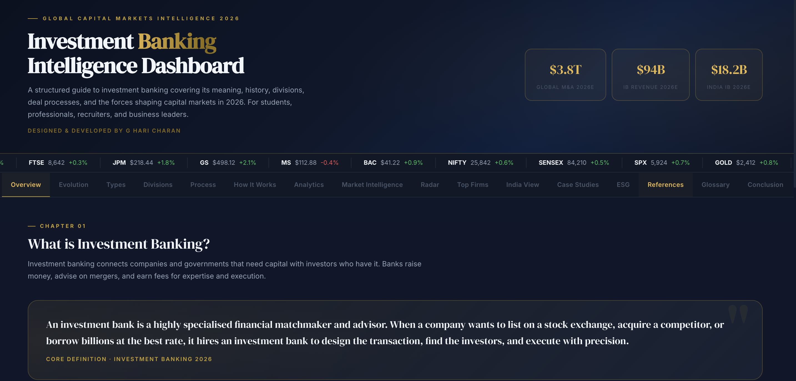

# Investment Banking Intelligence Dashboard


An interactive web-based dashboard designed to explore the world of investment banking through structured learning, financial storytelling, and modern web technologies.


## Explore the Project

- **Live Dashboard:** https://urstrulyghc-5.github.io/investment-banking-intelligence-dashboard/
- **GitHub Repository:** https://github.com/urstrulyghc-5/investment-banking-intelligence-dashboard

---

# Table of Contents

1. Project Overview
2. Purpose
3. Key Features
4. Dashboard Preview
5. Technologies Used
6. Learning Outcomes
7. Repository Structure
8. Live Demonstration
9. License
10. Author

---

# 1. Project Overview

Investment banking serves as a foundation for capital formation, corporate growth, mergers and acquisitions, and financial markets. While these topics are frequently discussed, understanding how they work together within a single financial ecosystem can be challenging.

This dashboard was created to present investment banking through an interactive and structured learning experience. Rather than focusing on isolated concepts, it illustrates how capital markets, valuation, advisory services, corporate transactions, and strategic decision-making are interconnected.

The project combines financial knowledge, business analytics, research, and interactive web design to create an educational platform that is both informative and engaging.

---

# 2. Purpose

The purpose of this project is to make investment banking easier to understand through interactive visualisation and structured learning.

It represents a personal initiative to strengthen my understanding of investment banking while applying finance, business analytics, and modern web development to build a practical portfolio project.

The dashboard was designed to encourage exploration, simplify complex ideas, and provide an engaging learning experience for students, professionals, and anyone interested in financial markets.

---

# 3. Key Features

- Interactive introduction to investment banking
- Capital markets ecosystem
- Investment banking workflow
- Mergers and acquisitions lifecycle
- Initial Public Offering (IPO) process
- Valuation fundamentals
- Financial advisory concepts
- Global market intelligence
- Industry insights and case studies
- Interactive analytics and visual storytelling
- Responsive user interface
- Smooth animations and immersive navigation

---

# 4. Dashboard Preview

## 4.1 Overview



The dashboard introduces the core concepts of investment banking through a structured overview supported by interactive visual elements.

---

## 4.2 Evolution


A visual representation of the evolution of investment banking, highlighting how financial institutions and capital markets have transformed over time.

---

## 4.3 Interactive Radar


An interactive radar visualisation designed to explore key dimensions of investment banking and financial intelligence.

---

## 4.4 Case Studies


Selected case studies demonstrate the practical application of investment banking across corporate transactions and strategic financial decisions.

---

## 4.5 Conclusion


A summary of the key insights presented throughout the dashboard together with the broader significance of investment banking within global financial markets.

---

# 5. Technologies Used

- HTML5
- CSS3
- JavaScript
- Responsive Web Design
- Modern Browser APIs

---

# 6. Learning Outcomes

Developing this project strengthened my understanding of:

- Investment banking fundamentals
- Capital markets
- Corporate finance
- Mergers and acquisitions
- Initial Public Offerings
- Financial analysis
- Business analytics
- Information architecture
- User interface design
- Interactive web development
- Financial storytelling

---

# 7. Repository Structure

```text
investment-banking-intelligence-dashboard/
│
├── index.html
├── README.md
├── LICENSE
└── images/
    ├── hero-banner.png
    ├── overview.png
    ├── evolution.png
    ├── radar.png
    ├── case-studies.png
    └── conclusion.png
```

---

# 8. Live Demonstration

Experience the dashboard here:

**https://urstrulyghc-5.github.io/investment-banking-intelligence-dashboard/**

---

# 9. License

This project is licensed under the MIT License.

---

# 10. Author

## G Hari Charan

**MBA | Finance and Business Analytics**

I enjoy exploring investment banking, capital markets, financial research, business analytics, and building interactive digital experiences that make complex financial concepts easier to understand.

---

## Acknowledgement

This project reflects my commitment to continuous learning, analytical thinking, and the practical application of finance through interactive technology.

Thank you for taking the time to explore this project.
